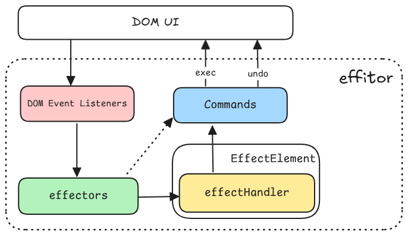

<p align="center">
  <a href="./index.md">English</a> |
  <a href="./index_zh.md">中文</a>
</p>

# 核心概念

背景

> 在富文本编辑场景中，用户的每个编辑动作都要求编辑器即时响应，否则将严重影响体验。而实现即时响应最直接的方式是操作 DOM，但这必须满足一个关键前提：**避免在短时间内触发大量导致浏览器重排/重绘的 DOM 操作**。
>
> 由于编辑操作本身要求“低延迟”，我们无法通过防抖、节流或批量延迟更新等通用优化手段来规避“短时间”这一约束。因此，优化的关键在于减少每次操作所涉及的 **DOM 更新量**。
>
> 为实现这一目标，`effitor` 引入了`效应元素（EffectElement）` 的概念。每个`效应元素`，都是一个 [自定义元素（CustomElement）](https://developer.mozilla.org/en-US/docs/Web/API/Web_components/Using_custom_elements)。所有关键节点均由 `效应元素` 构成，其内部封装了数据状态与更新逻辑。用户的所有编辑行为，都由效应元素决定如何处理，这些行为统称为`效应（Effect）`。
> 当用户操作发生时，由 `效应器（Effector）` 解析并`激活（invoke)`对应的 `效应`，再由挂载在 `效应元素` 上的 `效应处理器（EffectHandler）` 处理这些`效应`（执行具体的 DOM 操作）。这种设计确保了每次编辑仅触发**局部、精确、最小化**的 DOM 更新，从而在保证响应速度的同时，维持优异的运行时性能。



## 效应器（effector）

效应器是编辑器内部一系列DOM事件回调函数的集合，负责处理用户行为，并激活对应的效应。

编辑器内部有多个插件效应器以及一个主效应器。对于每一个注册的DOM事件，先执行插件效应器对应的回调函数，当且仅当返回true时，终止后续插件执行。在对应回调函数内，可通过编辑器上下文设置跳过主效应器的执行（类似Event.preventDefault）。

对于键盘事件和输入事件，回调函数会根据按键类型或输入类型整合为一个`Solver`

```ts
const effector: Et.Effector = {
  keydownSolver: {
    Tab: (ev, ctx) => {
      /** 处理Tab键按下事件 */
    },
    Enter: (ev, ctx) => {
      /** 处理回车键按下事件 */
    },
    // ...
  },
  beforeInputSolver: {
    insertText: (ev, ctx) => {
      /** 处理插入文本 */
    },
    insertParagraph: (ev, ctx) => {
      /** 处理插入段落 */
    },
    // ...
  },
  copyCallback: (ev, ctx) => {
    /** 处理copy事件 */
  },
  selChangeCallback: (ev, ctx) => {
    /** 处理selectionchange事件 */
  },
  // ...
  onMounted: () => {
    /** 在编辑器挂载后执行 */
  },
  onBeforeUnmount: () => {
    /** 在编辑器卸载前执行 */
  },
  // ...
};
```

在`v0.2.0`版本，多个插件的效应器会在编辑器初始化时被按顺序合并成一个插件效应器，最终编辑器只有两个效应器，主效应器以及插件效应器。

## 效应元素（effectElement）

效应元素通过自定义元素（[CustomElement](https://developer.mozilla.org/en-US/docs/Web/API/Web_components/Using_custom_elements)）实现。效应元素基类是`EffectElement`，继承该类的自定义元素，即为效应元素。在编辑器运行时，会检查html元素上是否有`ETCODE`symbol属性，如果存在，则该元素为效应元素。

```ts
// @internal
const ETCODE = Symbol("ETCODE");
// @internal
const IN_ETCODE = Symbol("IN_ETCODE");
// @internal
const NOT_IN_ETCODE = Symbol("NOT_IN_ETCODE");

abstract class EffectElement extends HTMLElement {
  static abstract readonly elName: string;

  static readonly etType = 0;
  static inEtType = 0;
  static notInEtType = 0;

  readonly [ETCODE]: number;
  readonly [IN_ETCODE]: number;
  readonly [NOT_IN_ETCODE]: number;

  get etCode() {
    return this[ETCODE];
  }
}

class EtParagraphElement extends EffectElement {
  static readonly elName = "et-p";
}
```

效应元素和普通HTML元素一样，效应元素在编辑器内呈现什么样子，取决于其css样式以及子节点内容。

编辑器内的每个操作，都是对效应元素及其后代节点的操作。每个操作前后，编辑器都会更新上下文，上下文记录了当前光标/选区位置所处的效应元素（`focusEtElement & commonEtElement`），编辑器会根据该效应元素，来决定下一次编辑操作如何执行。

> [!IMPORTANT]
> 效应元素的`etCode`属性(即`ETCODE`)是一个`symbol`属性，由编辑器内部维护。在开发过程中，需要留意，**_测试时不要混杂开发环境代码和生产环境代码_**（这通常取决于项目的目录结构和 import 的导入方式，不同的导入方式以及 tsconfig 或 vite 配置，vite 可能会从`src`源码中或`dist`产物中导入），因为两份代码所创建的`ETCODE`是不同的，虽然在控制台输出时两个都是`Symbol("ETCODE")`，但其对应的是两个不同的Symbol对象。
> 而效应码工具`etcode`（在编辑器内部广泛使用），使用指定的那个`ETCODE`来检查效应元素，如果某个效应元素上的`ETCODE`属性与指定的`ETCODE`不同，`etcode.check`会认为它不是效应元素，从而导致意外的测试结果。
> 这通常不会遇到，但需要在此强调。因为在不知情的情况下遇到该问题，可能 debug 都无从下手。

## 效应处理器（effectHandler）

效应处理器由一系列效应处理函数组成。效应处理器的属性名即`效应`，属性值即`效应处理函数`。

使用`ts`类型增强来声明效应。

```ts
// augment.ts
import type { Et } from "@effitor/core";

type EffectAPayload = { data: string };
declare module "@effitor/core" {
  interface EffectHandleDeclaration {
    // 注意：效应处理函数的参数列表是固定的，
    // 额外声明的效应处理函数，可通过重载`payload`的类型来指定接收的参数类型,
    // 如果该效应不需要 payload, 可省略或声明为`void`类型.
    effectA: (
      this: Et.EffectHandleThis,
      ctx: Et.EditorContext,
      payload: EffectAPayload,
    ) => boolean;
    // 或直接通过工具函数来声明
    effectB: Et.EffectHandle<void>;
  }
}
export {};
```

实现

```ts
// handler.ts
export const handler: Et.EffectHandler = {
  effectA(ctx, { data }) => {
    // 处理效应A
    // 也可通过this调用其他效应
    this.effectB?.(ctx)
  }
}
```

激活效应

```ts
// 激活当前光标所在效应元素的效应A
ctx.effectInvoker.invoke(ctx.focusEtElement, "effectA", ctx, { data: "hello" });
```

效应处理器想要生效，必须挂载到指定效应元素上。若挂载到效应元素基类`EffectElement`上，则对应的效应及效应处理函数对所有效应元素都有效（除非被覆盖）。

```ts
import { EffectElement } from "@effitor/core";
import { handler } from "./handler";

const usePlugin = () => {
  return {
    // ...
    register(ctxMeta, setSchema, extendEtElement) {
      extendEtElement(EffectElement, handler, []);
    },
  };
};
```

本质上，效应处理器最终会挂载到效应元素类对象（构造器）上，通过编辑器上下文上的效应激活器`effectInvoker`，从指定效应元素上激活特定效应并执行相应的效应处理函数。

### 深入效应

effitor 将编辑器内的特定行为称为效应，通过 ts 类型增强来声明，通过效应处理函数来实现。效应元素和效应处理器使用了面向对象的思想，得益于 js 原型链的设计，子类效应元素自动继承父类的效应处理器。而子类重新绑定的效应处理器（准确的说，是效应处理函数），会覆盖父类对相应效应的处理方式，相当于重写（override）了父类指定效应的处理函数。

其原理很简单，挂载一个效应处理器到效应元素上时，我们将效应处理器这个对象直接 assign 到效应元素类对象（构造器）上。激活某个效应时，我们先获取指定效应元素（即自定义的 html 节点）的类对象（构造器），然后从类对象上获取对应效应的处理函数。根据 js 原型链的设计，从子类构造器上访问属性时，如果查找失败，会沿着原型链向上查找，即从父类构造器中查找，由此实现效应的继承和重写。

目前 effitor 还有很多功能是直接实现的，我们正考虑逐步将这些功能都以效应的形式实现，以提高编辑器的可扩展性和可维护性，逐步形成“effitor 内，一切皆效应”的思想。

### 现有内置效应列表：

| 效应                              | 描述    | 回调效应^1 | 备注                       |
| --------------------------------- | ------- | ---------- | -------------------------- |
| `InsertParagraphAtParagraphEnd`   | // todo | ✅         |                            |
| `InsertParagraphAtParagraphStart` | // todo | ✅         |                            |
| `DeleteBackwardAtParagraphStart`  | // todo | ✅         |                            |
| `DeleteForwardAtParagraphEnd`     | // todo | ✅         |                            |
| `InsertCompositionTextSuccess`    | // todo | ✅         |                            |
| `TransformInsertContents`         | // todo | ✅         |                            |
| ~~`DeleteContentsSpanningStart`~~ | // todo | ✅         |                            |
| ~~`DeleteContentsSpanningEnd`~~   | // todo | ✅         |                            |
| `InsertCompositionTextInRawEl`    | // todo | ✅         | 选区在原生编辑节点^2内生效 |
| `InsertTextInRawEl`               | // todo | ✅         | 选区在原生编辑节点内生效   |
| `DeleteInRawEl`                   | // todo | ✅         | 选区在原生编辑节点内生效   |
| `DeleteTextInRawEl`               | // todo | ✅         | 选区在原生编辑节点内生效   |
| `ReplaceTextInRawEl`              | // todo | ✅         | 选区在原生编辑节点内生效   |
| `FormatIndentInRawEl`             | // todo | ✅         | 选区在原生编辑节点内生效   |
| `FormatOutdentInRawEl`            | // todo | ✅         | 选区在原生编辑节点内生效   |
| `tabout`                          | // todo | ✅         |                            |
| `dblSpace`                        | // todo | ✅         |                            |

备注：

1. 回调效应指编辑器核心会在特定时机主动调用的效应，如`DeleteBackwardAtParagraphStart`会在光标在段落开头按下退格键（`Backspace`）时被调用。
2. 原生编辑节点指的是`textarea`和`input[type="text"]`。

## 上下文

上下文包括`编辑器上下文（EditorContext）`和`插件上下文（PluginContext）`。

### 编辑器上下文

编辑器上下文是编辑器的核心，编辑器的行为由编辑器上下文上的各个模块进行处理。这些模块有：

- `selection`：选区模块
- `composition`：输入法模块
- `pctx`：插件上下文
- `assists`：助手（插件）模块
- `effectInvoker`：效应激活器

### 插件上下文

插件上下文`pctx`是一个挂在`编辑器上下文`上的对象，通常情况下，插件将自身的配置信息或工具绑定在`pctx`上，使得插件能够在编辑器各个生命周期阶段通过`ctx.pctx`访问到想要的信息。

```ts
export interface EditorPluginContext {
  [k: string]: any;
}
interface EditorContext {
  pctx: EditorPluginContext;
}
```

> [!NOTE] `pctx`在每个编辑器上下文ctx实例上都有一份。
> 插件上下文仅在插件被注册时创建到指定编辑器上下文ctx实例中。

# 插件化

effitor的核心仅提供一套处理 DOM 操作的 API，并实现基础的文本操作；“富文本”则必须通过插件实现。每个effitor插件，都是效应器、效应元素与效应处理器的组合。一般来说，插件应至少有一个效应器。

effitor的插件分两类：助手插件（assist）和内容插件（plugin）。

## 助手插件 assist

助手插件通常不携带效应元素，并最终挂载到编辑器上下文的 assists 属性上，供其他插件使用，或实现特定的编辑器功能，如工具栏、悬浮菜单等。

```ts
export interface EditorAssists {
  [k: string]: any;
}
interface EditorContext {
  assists: EditorAssists;
}
```

内置的助手有：

- [ ] `assist-ai`：AI 助手
- [x] `assist-counter`：字数统计
- [x] `assist-dialog`：对话框
- [x] `assist-dropdown`：下拉菜单
- [x] `assist-message`：消息
- [x] `assist-popup`：弹窗或悬浮菜单
- [ ] `assist-toolbar`：工具栏

## 内容插件 plugin

插件通常用于丰富编辑器文档结构，通过注册额外的效应元素，让编辑器支持特定的富文本结构。

内置的插件有：

- [x] `plugin-heading`：标题
- [x] `plugin-mark`：高亮（加粗/斜体/删除线/内敛代码/高亮）
- [x] `plugin-list`：列表
- [x] `plugin-link`：链接
- [x] `plugin-media`：媒体（图片/音/视频）
- [x] `plugin-code`：代码块（支持渲染 html 和 latex）
- [ ] `plugin-math`：数学公式
- [ ] `plugin-table`：表格
- [ ] `plugin-blockquote`：引用块
- [ ] `plugin-excalidraw`：Excalidraw

## 自定义插件

```ts
// 核心的所有类型可统一地通过 Et 命名空间访问
import type { Et } from "@effitor/core";

// 插件定义
type PluginOptions = {};
export const usePlugin = (options?: PluginOptions): Et.EditorPlugin => {
  return {
    name: "plugin-name",
    cssText: ``, // 插件css样式
    effector: {}, // 效应器，也可提供一个数组
    etElements: [], // 需要注册的效应元素
    register(ctxMeta, setSchema, extendEtElement) {
      // 插件注册函数
    },
  };
};

// 使用插件
const editor = new Effitor({
  plugins: [usePlugin()],
});
```

# 命令系统

命令系统是 effitor 的底层，它赋予了编辑器直接操作 DOM 和撤回已执行的操作的能力。由于 effitor 没有抽象的数据模型，一切文档数据和操作都基于 DOM 进行，直接的 DOM 操作很容易破坏文档结构。为此，effitor 的命令基于严格的配置，只有正确配置的命令，才具备安全的撤回能力。

## 命令对象

effitor 的命令系统有 10 个基础命令（原子命令），它们分别是：

- `Insert_Composition_Text`：插入输入法文本
- `Insert_Text`：插入文本
- `Delete_Text`：删除文本
- `Replace_Text`：替换文本
- `Insert_Node`：插入节点
- `Remove_Node`：删除节点
- `Replace_Node`：替换节点
- `Insert_Content`：插入内容（DocumentFragment）
- `Remove_Content`：删除内容（连续的同层节点）
- `Functional`：功能命令（函数式命令）

effitor 提供了一个工具：`cmd`命令工厂，用于创建命令。

```ts
import { cmd } from "@effitor/core";

/** 创建一个命令: 插入输入法文本 */
cmd.insertCompositionText(init);
/** 创建一个命令: 插入文本到文本节点 */
cmd.insertText(init);
/** 创建一个命令: 从文本节点删除文本 */
cmd.deleteText(init);
/** 创建一个命令: 从文本节点替换文本 */
cmd.replaceText(init);
/** 创建一个命令: 插入节点 */
cmd.insertNode(init);
/** 创建一个命令: 移除节点 */
cmd.removeNode(init);
/** 创建一个命令: 替换节点 */
cmd.replaceNode(init);
/** 创建一个命令: 插入内容片段 */
cmd.insertContent(init);
/** 创建一个命令: 移除内容片段 */
cmd.removeContent(init);
/** 创建一个命令: 功能命令 */
cmd.functional(init);
```

`cmd`创建的命令可以执行和撤回，通常我们不需要也不建议手动执行和撤回。effitor 借助上下文上的命令管理器来管理命令的生命周期。

## 命令管理器

```ts
/** 命令管理器 */
class CommandManager {
  // ...
}
/** 编辑器上下文 */
class EditorContext {
  readonly commandManager: CommandManager;
}
```

一个命令的生命周期

```ts
// 创建并添加
ctx.commandManager.push(
  cmd.functional({
    execCallback(ctx) {
      // 执行或重做命令
    },
    undoCallback(ctx) {
      // 撤回命令
    },
  }),
);
// 执行已添加的命令
ctx.commandManager.handle();
// 丢弃已执行但未确认的命令（自动撤销）
// ctx.commandManager.discard()
// 确认已执行的命令
ctx.commandManager.commit();
// 撤回已确认的命令
ctx.commandManager.undoTransaction();
// 重做
ctx.commandManager.redoTransaction();
```

# 选区系统

选区基于原生`Selection API`，`Range API`封装。只要理解这两个标准API，就很容易理解 effitor 的选区系统。

effitor 的选区系统由三部分组成：选区、目标光标/范围、光标范围。

## 选区（EtSelection）

选区主要用于交互，理解用户当前行为所处的文档位置，以及更新上下文相关信息。

## 目标光标/目标范围（TargetCaret/TargetRange）

目标光标/范围主要用于初始化命令，效应器或效应处理函数，根据目标光标/范围来确定激活什么效应，添加什么命令。

## 光标/范围（CaretRange、SpanRange）

光标范围主要用于命令，在命令执行时确定要作用的光标位置，SpanRange用于删除；CaretRange 用于插入，以及在命令执行后确定新的选区（光标/范围）位置。

effitor 提供了一个工具`cr`，用于快速创建光标范围。

```ts
import { cr } from "@effitor/core";
```
